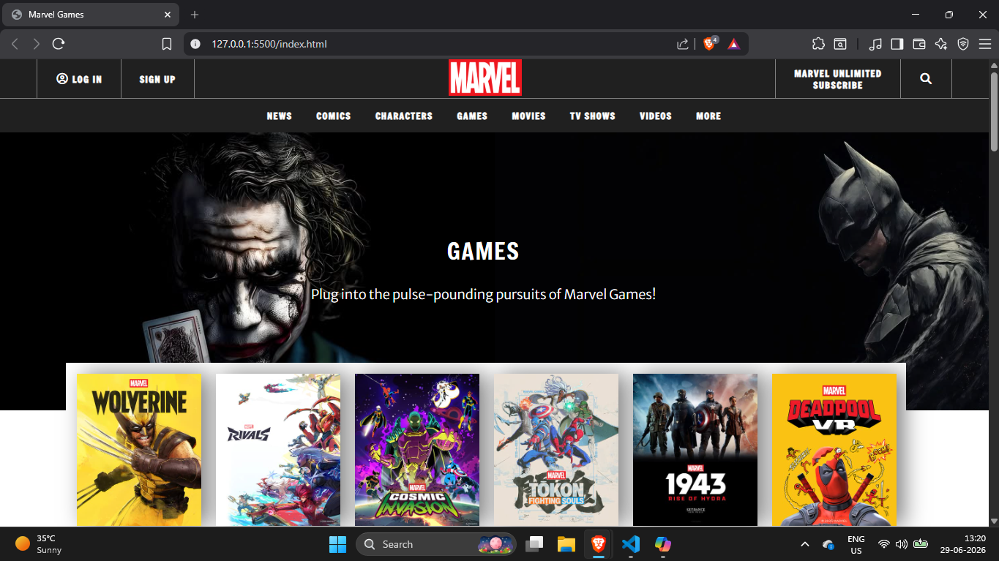
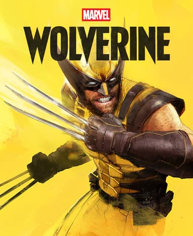
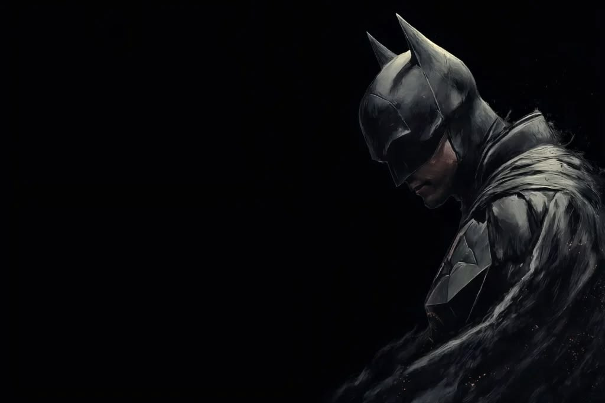

# Marvel Games Landing Page Clone 🎮

An immersive Marvel Games landing page clone built with responsive HTML5 and cinematic CSS3. This project was created as my first frontend clone and demonstrates layout, typography, and image-driven design.

## Links 🔗

- Original website: https://www.marvel.com/games
- Live demo: [Add live demo URL here]
- Local demo: Open `index.html` in your browser or serve the folder with a static server

## Screenshots 🖼️

## Project structure 📁

- `index.html` - main landing page markup
- `style.css` - styling for the landing page
- `imgs/` - image assets used by the site

## Features ✨

- Responsive navigation bar with top and bottom sections
- Hero banner section featuring Marvel game artwork
- Featured game cards section
- Latest games news section

## How to use ▶️

1. Open `index.html` in your browser.
2. Review the layout and styling in `style.css`.

## Notes 📝

- This was my first clone project.
- The project is a static frontend clone and does not include JavaScript.
- Image assets are stored in the `imgs/` folder.
- External fonts are loaded from Google Fonts.
- Font Awesome is used for icon rendering.

